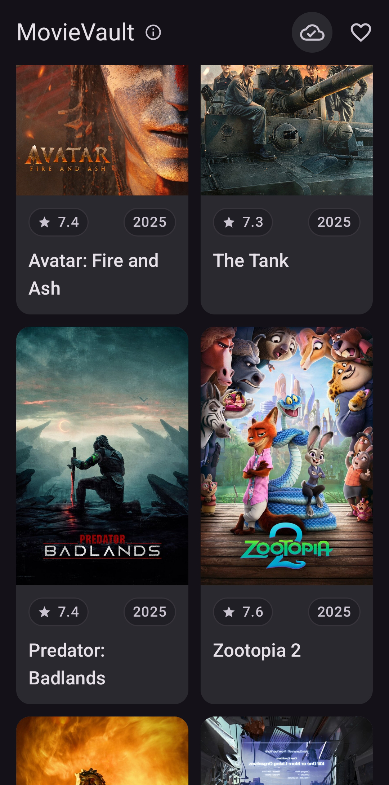
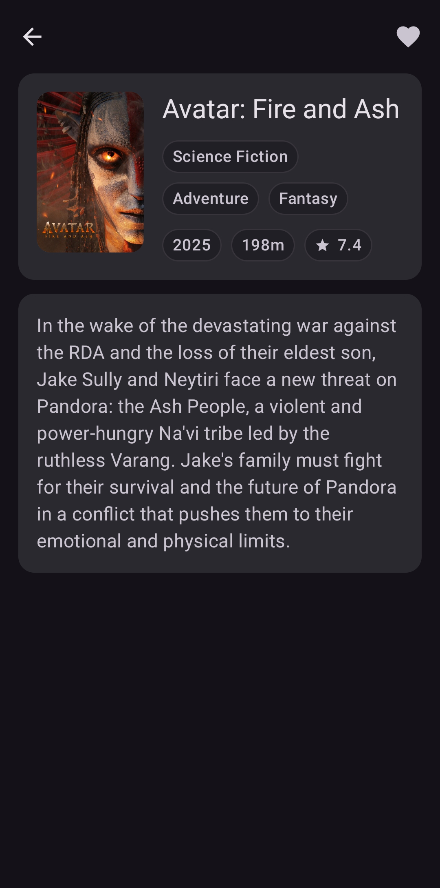
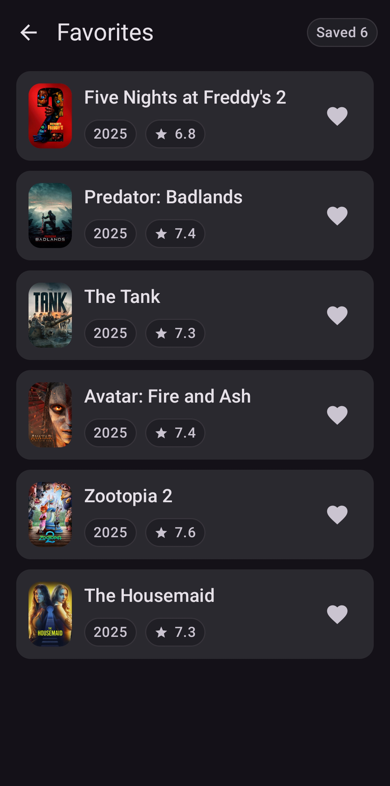
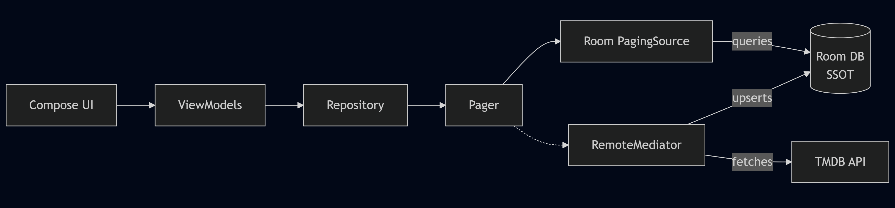

# MovieVault


A modern Android movie browser (Catalog / Details / Favorites) built with Kotlin + Jetpack
Compose.  
It demonstrates production-grade Android engineering: modular architecture, offline-first data,
Paging 3 (RemoteMediator), resilient UI state + error handling, thorough tests (unit +
instrumentation), and CI.

## Preview

- **[Watch demo video (~40s)](https://www.youtube.com/watch?v=5gKHrLQAiHo)**
- **[Download APK](https://github.com/farukgdev/movie-vault-android/releases/latest)**

### Screenshots

| Catalog                                                                                                                                    | Details                                                                                                                                        | Favorites                                                                                                                                        |
|--------------------------------------------------------------------------------------------------------------------------------------------|------------------------------------------------------------------------------------------------------------------------------------------------|--------------------------------------------------------------------------------------------------------------------------------------------------|
| <a href="docs/assets/screenshots/01_catalog.png"></a> | <a href="docs/assets/screenshots/02_detail.png"></a> | <a href="docs/assets/screenshots/03_favorites.png"></a> |

## Features

- Browse popular movies
- View movie details
- Add/remove favorites and view your saved list
- Works offline with cached content

---

## Engineering highlights

### Modular structure

| Module               | Responsibility                                                                               |
|----------------------|----------------------------------------------------------------------------------------------|
| `:app`               | app entry point, theming, navigation host                                                    |
| `:core`              | shared UI components, scaffold controller, result + error model, test tags                   |
| `:data`              | repositories, Room DB/DAOs/entities + migrations, remote data sources, paging + cache policy |
| `:feature:catalog`   | catalog + detail screens, ViewModels                                                         |
| `:feature:favorites` | favorites screen, ViewModel                                                                  |

### Architecture at a glance

**Room is the source of truth**: screens render from Room, and `RemoteMediator` syncs TMDB into the
database.



- The repository provides a paging stream; ViewModel adapts it for the UI, and Compose collects and
  renders it.
- Data is always read from Room, so cached content stays usable when the network fails.
- When a refresh is needed or more items are requested (scroll), Paging triggers `RemoteMediator`.
- `RemoteMediator` fetches the required page(s) from TMDB and upserts movies + pagination state into
  Room, which automatically updates what the UI renders.

### Progressive detail loading (partial → full)

- The detail screen renders immediately from cached catalog fields fields (
  title/poster/year/rating).
- When the detail screen opens, full details are fetched automatically if they're not cached, and
  merged into the same movie row.
- If fetching fails and cached data exists, the UI shows a non-blocking banner with retry while
  keeping the screen usable.

### UI resilience

- Network calls go through `safeApiCall`, mapping failures into a typed error model so UI behavior
  stays consistent.
- Error UI is scoped by cache availability:
    - **full-screen** only when there's no usable cached content
    - otherwise keep content visible and surface retry via **banner/snackbar**
- Catalog refresh is split intentionally:
    - **manual refresh** gives immediate feedback and can reset scroll position to the top on
      success
    - **background refresh** only updates status icon and avoids disruptive UI changes (no surprise
      jumps)
- Skeleton placeholders keep layout stable during load/refresh.

### Navigation guardrails

- Uses **Navigation 3**.
- A small custom navigator layer prevents common edge cases:
    - double-tap navigation spam
    - back presses during in-flight transitions

### Testing

- Unit tests focus on correctness and edge cases: paging sync, cache/freshness policy, repository +
  DAO behavior (including migrations), ViewModel state, and navigation guardrails.
- Instrumentation tests validate end-to-end flows and offline/refresh behavior using stable
  `testTag`s.
- Fakes (repositories/remote + controllable clock) keep scenarios deterministic and reproducible.

### CI

GitHub Actions runs on pull requests and `main`:

- unit tests
- instrumented tests on an emulator

---

## Tech stack

- Kotlin, Coroutines, Flow
- Jetpack Compose + Material 3
- Hilt (DI)
- Room + Paging 3 + RemoteMediator
- Retrofit + OkHttp
- Kotlinx Serialization
- Coil 3 (image loading + memory/disk caching)

---

## Getting started

### Option A: Install the release APK

- **[Download APK](https://github.com/farukgdev/movie-vault-android/releases/latest)**
- If prompted, allow installs from unknown sources.

### Option B: Run from source (use your own TMDB API key)

1. Clone the repo:
   ```bash
   git clone https://github.com/farukgdev/movie-vault-android.git
   cd movie-vault-android
   ```

2. Add your TMDB API key to `local.properties`:
   ```properties
   TMDB_API_KEY=YOUR_KEY_HERE
   ```

3. Open the project in Android Studio and run the `app` configuration.

---

## Running tests

- Unit tests:
  ```bash
  ./gradlew testDebugUnitTest
  ```

- Instrumented tests (connected device/emulator required):
  ```bash
  ./gradlew :app:connectedDebugAndroidTest
  ```

---

## License

MIT. See [LICENSE](LICENSE).

## Data source

Movie data comes from TMDB.
